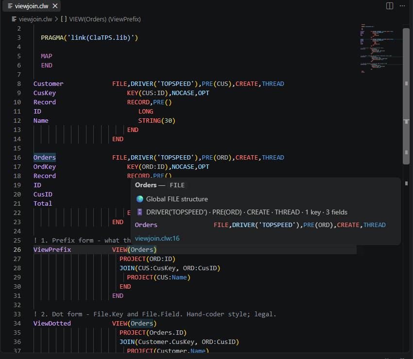
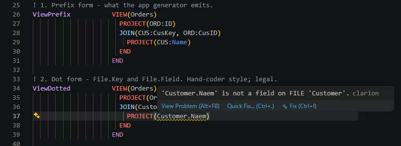
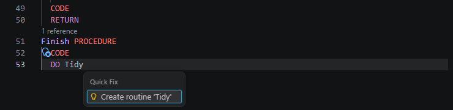
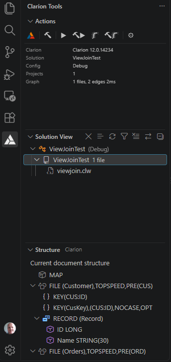

# Clarion Extension for Visual Studio Code

Clarion language support for Visual Studio Code: navigation, hover, IntelliSense, diagnostics, refactoring and builds, backed by a language server that understands whole solutions. Built and measured against real generated applications, 40 projects and 3,000 source files at a time, so the things a Clarion IDE user expects to work on a generated app, ABC or Legacy templates alike, work here too.

- [Quick start](docs/guides/quick-start.md) — five minutes to your first solution
- [Common tasks](docs/guides/common-tasks.md) — how do I…
- [Changelog](CHANGELOG.md) — what changed in each release
- [Issues](https://github.com/msarson/Clarion-Extension/issues) — bugs and requests

---

## Features

### Navigation and hover

Works in the current file with no solution open; opens out across files when a solution is loaded.

- F12, Ctrl+F12 and Shift+F12 for definition, implementation and references, aware of scope, overloads, routines, `PRE:Field` and `Structure.Field` access, and the procedure names an EXE shares with its DLLs.
- Hover cards that say what a thing is: a FILE with its driver, prefix and keys; a MAP prototype labelled Global, Module or Private; a structure field the same from its declaration or any qualified use.
- Reference counts above every procedure, method, class and routine, exact once the index is warm.
- Rename across the workspace, document highlight, workspace symbol search, and chained access such as `SELF.Order.RangeList.Init` resolved through CLASS, QUEUE and GROUP types.
- Call hierarchy (Shift+Alt+H) for procedures, methods and routines, in both directions.
- Hover on a keyword that only makes sense in context: an `END` or a period says which structure it closes and links back to it; `ELSE`, `ELSIF`, `OF` and `OROF` say which IF or CASE they belong to.
- In a solution with several projects, a name is resolved through the redirection of the project that compiles the file you are in.
- [Navigation in detail](docs/features/navigation.md)

### IntelliSense and signature help

- Member completion after `SELF.`, `PARENT.`, `MyVar.` or `ClassName.`, walking inheritance and honouring PRIVATE and PROTECTED.
- Parameter hints for 272 built-in functions and for class methods, with the overload narrowed by the argument types as you type.
- Documented completions and hover for `PROP:`, `PROPPRINT:` and `EVENT:` equates, and for `?` field equates scoped to the current window.
- [Signature help in detail](docs/features/signature-help.md)

### Diagnostics

Reported as you type, following the compiler's rules; where the rule was unclear it was settled by compiling a fixture.

- Unterminated structures, missing RETURN, FILE validation, VIEW field references checked against the owning file.
- Missing INCLUDE and missing project DefineConstants, each with a quick fix that adds the line.
- Discarded return values, a literal passed by reference, a call to a PRIVATE procedure from another module, undeclared variables, missing implementations and indistinguishable overloads.
- Character-set validation that respects every Windows ANSI code page and the Clarion 12 `!UTF8` directive.
- Every check has its own setting and its own severity, with one switch for all of them; changes take effect as you make them.
- Opt-in: a call to a procedure that no MAP, MODULE, include or indexed file declares.
- [Diagnostics in detail](docs/features/diagnostics.md)

### Refactoring and quick fixes

On Ctrl+.: Surround With, Negate Condition, Flip IF/ELSE, Introduce EQUATE, and Create routine from an unresolved `DO`. [Code editing in detail](docs/features/code-editing.md)

### Solutions and builds

- Open a folder; the extension finds the `.sln`, reads the projects, and follows Clarion's redirection files exactly as the IDE does, including per-configuration sections.
- Installed Clarion versions are discovered from the IDE's settings; a `ClarionProperties.xml` kept anywhere else can be chosen, and the build follows it.
- Build from the Solution View with live output, projects ordered by dependency, and each build states what it is building, in which configuration, and the MSBuild command line. A solution that loads in a degraded state says so instead of silently returning nothing.
- The Clarion version is remembered per solution and can be changed while it is loaded: the editor and the build follow the new install at once, without a reload. A version the properties file no longer registers is reported rather than used.
- Settings are read and written in one place, so a pick sticks in a multi-root workspace; settings an earlier version wrote into a folder, which override the `.code-workspace` file, are reported with an offer to remove them.
- [Solution management in detail](docs/features/solution-management.md)

### Editing and syntax

Syntax highlighting for Clarion and the template language, including the Clarion 12 Unicode preview; folding; 99 snippets; Paste as Clarion String; Add Method Implementation; a New Class wizard; a document formatter. Template files get highlighting only. [Snippet reference](docs/reference/snippets.md)

### Performance

Indexes persist across sessions and background work is time-sliced, so a 40-project solution is ready in about two seconds and interactive in about five, and typing, hover and navigation are never blocked. Reading a source file is about three times faster than in 1.0.3, and background checking stops as soon as you type rather than finishing work your edit has already replaced. Opt-in tracing (`clarion.log.performance.enabled`) produces a full timeline for support, and `clarion.log.level` captures a diagnostic log for a bug report.

---

## Requirements and installation

- Windows. The extension drives Clarion's own toolchain and does not run on macOS or Linux.
- Visual Studio Code 1.97 or later.
- Clarion 10, 11 or the 12 beta, for solution features and builds; editing and single-file navigation work without one.

Install from the Marketplace: open Extensions (`Ctrl+Shift+X`), search for **Clarion Extensions**, and install. [Detailed installation instructions](docs/guides/installation.md).

---

## What's new

### 1.0.5 (2026-09-18)

Eight changes, most of them names the extension could not resolve in a real generated application. Each came from someone running it over their own code rather than from a test case.

- Find All References answers the same way wherever it is asked: at a procedure declared in a program’s MAP it now lists the uses in every module of that program, not only the modules the MAP itself names.
- Names written the way generated applications write them resolve: a prefix that runs past eight characters, such as the `CommonLib:Init` call every linked DLL gets, and a prefixed prototype indented inside a MAP rather than at column 0.
- Procedures prototyped in an include file are found again — a MAP that pulls its prototypes in with `INCLUDE('file.inc','PROTOTYPES')` records them as declarations, using only the section the INCLUDE names, as the compiler does.
- Whitespace around the member-access dot is read the way the compiler reads it: `Receiver   .Method(42)` is a method call, while a space *after* the dot ends the statement and hover no longer describes it as a member access.
- Completion offers ROUTINE labels, and after `DO` offers only those; hovering a routine names the procedure it belongs to.
- Reported by Bill Atchison, with contributions from [@geircodes](https://github.com/geircodes).

**Earlier:** 1.0.4 (2026-09-17) was a release about what a real solution runs into — which Clarion version and settings are actually in force, how a name resolves across a multi-project solution and a DLL family, and how Clarion source is read when it is written the way the compiler allows rather than the way generated code looks — and made editing large modules markedly quicker; 1.0.3 (2026-09-13) made generated code read correctly, from the MAP shapes an app generator emits to the FILE, VIEW and KEY structures underneath, and removed the last second-long cold starts. [Full changelog](CHANGELOG.md).

---

## Documentation

- Guides: [Quick start](docs/guides/quick-start.md), [Common tasks](docs/guides/common-tasks.md), [Installation](docs/guides/installation.md)
- Features: [Navigation](docs/features/navigation.md), [Signature help](docs/features/signature-help.md), [Solution management](docs/features/solution-management.md), [Diagnostics](docs/features/diagnostics.md), [Code editing](docs/features/code-editing.md)
- Reference: [Commands](docs/reference/commands.md), [Settings](docs/reference/settings.md), [Snippets](docs/reference/snippets.md), [Clarion language reference](https://github.com/msarson/Clarion-Extension/wiki/Clarion-Language-Reference) (wiki)

## Support and feedback

- [GitHub Issues](https://github.com/msarson/Clarion-Extension/issues) for bugs and requests
- [Discussions](https://github.com/msarson/Clarion-Extension/discussions) for questions and tips

## License

[MIT License](LICENSE)

## Acknowledgments

- **fushnisoft** for the original Clarion syntax highlighting
- The Clarion community for feedback and testing

## Contributors

<!-- ALL-CONTRIBUTORS-BADGE:START - Do not remove or modify this section -->

<!-- ALL-CONTRIBUTORS-BADGE:END -->

Thanks to everyone who has helped improve the Clarion Language Extension through code, bug reports, testing, ideas, documentation and their knowledge of the Clarion language.

<!-- ALL-CONTRIBUTORS-LIST:START - Do not remove or modify this section -->
<!-- prettier-ignore-start -->
<!-- markdownlint-disable -->
<table>
  <tbody>
    <tr>
      <td align="center" valign="top" width="14.28%"><a href="https://github.com/geircodes"> <b>geircodes</b></a> <a href="https://github.com/msarson/Clarion-Extension/commits?author=geircodes" title="Code">💻</a> <a href="https://github.com/msarson/Clarion-Extension/issues?q=author%3Ageircodes" title="Bug reports">🐛</a> <a href="#ideas-geircodes" title="Ideas, Planning, & Feedback">🤔</a></td>
      <td align="center" valign="top" width="14.28%"><a href="https://github.com/Chahton"> <b>Edin Čahtarević</b></a> <a href="https://github.com/msarson/Clarion-Extension/issues?q=author%3AChahton" title="Bug reports">🐛</a> <a href="#ideas-Chahton" title="Ideas, Planning, & Feedback">🤔</a> <a href="#userTesting-Chahton" title="User Testing">📓</a></td>
      <td align="center" valign="top" width="14.28%"><a href="https://github.com/ClarionLive"> <b>ClarionLive</b></a> <a href="https://github.com/msarson/Clarion-Extension/issues?q=author%3AClarionLive" title="Bug reports">🐛</a> <a href="#ideas-ClarionLive" title="Ideas, Planning, & Feedback">🤔</a> <a href="#userTesting-ClarionLive" title="User Testing">📓</a></td>
      <td align="center" valign="top" width="14.28%"><a href="http://celeron533.github.io/"> <b>Allen Zhu</b></a> <a href="https://github.com/msarson/Clarion-Extension/commits?author=celeron533" title="Code">💻</a></td>
      <td align="center" valign="top" width="14.28%"><a href="http://fushnisoft.com"> <b>Brahn Partridge</b></a> <a href="https://github.com/msarson/Clarion-Extension/commits?author=fushnisoft" title="Code">💻</a></td>
      <td align="center" valign="top" width="14.28%"><a href="https://github.com/MarkGoldberg"> <b>Mark Goldberg</b></a> <a href="https://github.com/msarson/Clarion-Extension/issues?q=author%3AMarkGoldberg" title="Bug reports">🐛</a></td>
      <td align="center" valign="top" width="14.28%"><a href="https://carlosgutierrez.mx"> <b>Carlos Gutierrez</b></a> <a href="https://github.com/msarson/Clarion-Extension/issues?q=author%3ACarlosGtrz" title="Bug reports">🐛</a></td>
    </tr>
    <tr>
      <td align="center" valign="top" width="14.28%"><a href="https://github.com/ThaDaVos"> <b>Dylan Vos</b></a> <a href="https://github.com/msarson/Clarion-Extension/issues?q=author%3AThaDaVos" title="Bug reports">🐛</a></td>
      <td align="center" valign="top" width="14.28%"><a href="https://github.com/krosoftware"> <b>krosoftware</b></a> <a href="https://github.com/msarson/Clarion-Extension/issues?q=author%3Akrosoftware" title="Bug reports">🐛</a></td>
      <td align="center" valign="top" width="14.28%"><a href="https://github.com/jslarveEC"> <b>jslarveEC</b></a> <a href="https://github.com/msarson/Clarion-Extension/issues?q=author%3AjslarveEC" title="Bug reports">🐛</a></td>
      <td align="center" valign="top" width="14.28%"><a href="https://github.com/narduss"> <b>Nardus</b></a> <a href="https://github.com/msarson/Clarion-Extension/commits?author=narduss" title="Documentation">📖</a></td>
      <td align="center" valign="top" width="14.28%"><a href="https://www.boxsoft.net"> <b>Mike Hanson</b></a> <a href="#ideas-BoxSoft" title="Ideas, Planning, & Feedback">🤔</a></td>
      <td align="center" valign="top" width="14.28%"><a href="https://github.com/bill-atchison"> <b>William Atchison</b></a> <a href="https://github.com/msarson/Clarion-Extension/issues?q=author%3Abill-atchison" title="Bug reports">🐛</a> <a href="#ideas-bill-atchison" title="Ideas, Planning, & Feedback">🤔</a></td>
    </tr>
  </tbody>
</table>

<!-- markdownlint-restore -->
<!-- prettier-ignore-end -->

<!-- ALL-CONTRIBUTORS-LIST:END -->

This project follows the [all-contributors](https://github.com/all-contributors/all-contributors) specification. Contributions of any kind welcome!
